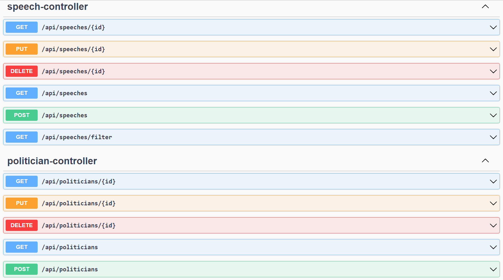

# Politician Speeches system
#### Description.
A politician will give many speeches in their political career. Many politicians
currently draft their speeches in an ad-hoc fashion using Microsoft Word and
share versions with their team using email. This process is inefficient as it does not
allow for the users to centrally store, archive, and search their speeches. This
challenge will require you to design a portion of a system to automate this
process.

### Requirements
1. View all their speeches saved in the system.
2. Add a speech to the system (for this challenge we will consider a speech to
   have the actual text, the author information, keywords about the speech
   and a speech date).
3. Edit a speech or its metadata
4. Delete a speech
5. The ability to search the speeches – (search by author, date range, subject
   area, or snippets of text from the speech body.

### Containerization
The App is containerized using docker and docker-compose.

### Extra Features
Reusing Docker Layers For Creating An Efficient Docker Image

### Endpoints and payloads
Using Postman Swagger UI for more Details (http://localhost:8080/ps-api-ui.html)



### ENDPOINTS

### speech-controller

* `GET /api/speeches/{id}` Get a specific speech by its id

200 Response
```json
{
   "id": 0,
   "text": "string",
   "speechDate": "2022-09-20T16:17:41.086Z",
   "subject": "string",
   "keywords": [
      {
         "id": 0,
         "name": "string"
      }
   ],
   "author": {
      "id": 0,
      "name": "string",
      "email": "string"
   }
}
```
*`PUT /api/speeches/{id}` Modify a specific speech by its id 

Request Body
```json
{
   "id": 0,
   "text": "string",
   "speechDate": "2022-09-20T16:18:45.952Z",
   "subject": "string",
   "keywords": [
      {
         "id": 0,
         "name": "string"
      }
   ],
   "author": {
      "id": 0,
      "name": "string",
      "email": "string"
   }
}
```
200 Response
```json
{
   "id": 0,
   "text": "string",
   "speechDate": "2022-09-20T16:19:21.906Z",
   "subject": "string",
   "keywords": [
      {
         "id": 0,
         "name": "string"
      }
   ],
   "author": {
      "id": 0,
      "name": "string",
      "email": "string"
   }
}
```
* `DELETE /api/speeches/{id}` Remove a specific speech by its id
  
200 Response 

`<no content>`

* `GET /api/speeches` Get All speeches filtering by: 
  
`text, keyword name, subject author name, start date, and end date`
 

200 Response
```json
[
   {
      "id": 0,
      "text": "string",
      "speechDate": "2022-09-20T16:20:14.056Z",
      "subject": "string",
      "keywords": [
         {
            "id": 0,
            "name": "string"
         }
      ],
      "author": {
         "id": 0,
         "name": "string",
         "email": "string"
      }
   }
]
```
* `POST /api/speeches` Create a new speech

Request body
```json
{
   "id": 0,
   "text": "string",
   "speechDate": "2022-09-20T16:23:25.570Z",
   "subject": "string",
   "keywords": [
      {
         "id": 0,
         "name": "string"
      }
   ],
   "author": {
      "id": 0,
      "name": "string",
      "email": "string"
   }
}
```
200 Response
```json
{
   "id": 0,
   "text": "string",
   "speechDate": "2022-09-20T16:23:25.573Z",
   "subject": "string",
   "keywords": [
      {
         "id": 0,
         "name": "string"
      }
   ],
   "author": {
      "id": 0,
      "name": "string",
      "email": "string"
   }
}
```
* `GET /api/speeches/filter` Alternative endpoint to get all speeches filtered using SearchCriteria

Parameters
`search`

200 Response
```json
[
   {
      "id": 0,
      "text": "string",
      "speechDate": "2022-09-20T16:25:35.111Z",
      "subject": "string",
      "keywords": [
         {
            "id": 0,
            "name": "string"
         }
      ],
      "author": {
         "id": 0,
         "name": "string",
         "email": "string"
      }
   }
]
```


### politician-controller

* `GET /api/politicians/{id}` Get a specific politician by its id

Parameters
`search`

200 Response
```json
{
   "id": 0,
   "name": "string",
   "email": "string"
}
```
* `PUT /api/politicians/{id}` Modify a specific politician by its id

Parameters
`search`

Request body
```json
{
   "id": 0,
   "name": "string",
   "email": "string"
}
```
200 Response
```json
{
   "id": 0,
   "name": "string",
   "email": "string"
}
```
* `DELETE /api/politicians/{id}` Remove a specific politician by its id
200 Response
  
`<no content>`

* `GET /api/politicians` Get All politicians filtered by name or email
```json
[
   {
      "id": 0,
      "name": "string",
      "email": "string"
   }
]
```
* `POST /api/courses` create a new Politician
 

Request
```json
{
   "id": 0,
   "name": "string",
   "email": "string"
}
```

200 Response
```json
{
   "id": 0,
   "name": "string",
   "email": "string"
}
```

### Exception Handling
All endpoints customized responses for the following HTTP statuses
* 200 OK
* 400 Bad Request
* 404 Not Found
* 409 Conflict
* 509 Internal Server Error 

#### Database Schema
```roomsql
CREATE TABLE politician (
  id BIGINT GENERATED BY DEFAULT AS IDENTITY NOT NULL,
  name VARCHAR(100) NOT NULL,
  email VARCHAR(255) NOT NULL,
  CONSTRAINT pk_politician PRIMARY KEY (id)
);

ALTER TABLE politician ADD CONSTRAINT uc_politician_email UNIQUE (email);

CREATE UNIQUE INDEX politician_email_index ON politician(email);

CREATE UNIQUE INDEX politician_name_index ON politician(name);

-- Speech table
CREATE TABLE speech (
  id BIGINT GENERATED BY DEFAULT AS IDENTITY NOT NULL,
  text VARCHAR(255),
  speech_date DATE,
  subject VARCHAR(255),
  politician_id BIGINT NOT NULL,
  CONSTRAINT pk_speech PRIMARY KEY (id)
);

CREATE INDEX speech_date_index ON speech(speech_date);

CREATE INDEX speech_subject_index ON speech(subject);

ALTER TABLE speech ADD CONSTRAINT FK_SPEECH_ON_POLITICIAN FOREIGN KEY (politician_id) REFERENCES politician (id);

-- Keyword Table
CREATE TABLE keyword (
  id BIGINT GENERATED BY DEFAULT AS IDENTITY NOT NULL,
  speech_id BIGINT,
  name VARCHAR(255) NOT NULL,
  CONSTRAINT pk_keyword PRIMARY KEY (id)
);

CREATE UNIQUE INDEX keyword_name_index ON keyword(name);

ALTER TABLE keyword ADD CONSTRAINT FK_KEYWORD_ON_SPEECH FOREIGN KEY (speech_id) REFERENCES speech (id);
```

### Preloaded Data
### `Pre Loaded Data`

`politician`

| ID| NAME| EMAIL |
| :------------: |:---------------| :-----|
|1 | Some Guy | someguy@gmail.com |
|2 | Amanda Poker | email@yahoo.com |
|3 | Ben Derhover | twt@email.com |
|4 | Rick Grimes | unknowm@email.com |

`speech`

|ID| TEXT|SPEECH_DATE|SUBJECT|POLITICIAN_ID |
| :------------: |:---------------| :-----|:-----|:-----|
|1| Hello! - This is my first Speech| 02/26/2019| first Subject| 1 |
|2| This is the second Speech| 03/12/2019| Second Subject| 1 |
|3| This is my Speech. Go for it!| 03/18/2019| My Subject| 2 |
|4| Some Text blablabla| 03/22/2019| Blabla Subject| 3 |
|5| Third Speech| 03/22/2019| Third Subject| 2 |
|6| Last Speech| 03/30/2019| Last Subject| 1 |

`keyword`

|ID| speech_id| name |
| :------------: |:---------------| :-----|
|1| 1|first |
|2| 1|Hello |
|3| 2|Second |
|4| 3|it |
|5|3|Go |
|6| 4|bla |
|7| 5|Third |
|8| 6|Last |

### Project Configuration Details

#### Docker

* `Inside the db-initialization folder contained the SQL scripts to initialize the database and populate it with some initial data.
  Those docker-compose use those files`
* `Inside the src/main/docker folder is contained the docker files to create the docker images`
* `.env file (located in root dir) contains the variables for db connection among others used by docker-compose 
  docker-compose.yml file (located in root dir) contains the docker containers configuration`


### Project Setup

Prerequisites
- Java 17 --> Necessary to create the jar file to run inside the container
- Docker 20.10.14 --> To run the app and download the external services
- git --> to clone the project

Steps
```shell
# download the source
git clone <repo-url>

# go into the cloned directory
cd politician-speeches

# build the project to create the jar file 
# (optional: use '-Dmaven.test.skip=true' to skip unit test cases)
mvn clean package

# Run the application in the container
# (optional: use '-d' to run docker in background)
docker-compose up

# Check is the app was successfully executed
docker-compose ps 

# Test the App with a web browser
-- Open a web browser go to http://http://localhost:8080/ps-api-ui.html
```

### Project Setup (ALTERNATIVE)

`in case you don't want to run the application using docker, you can run the PoliticianSpeechesApplication class using
an IDE like IntelliJ. In this scenario, the database must be up and  configured`

#### Technology Stack
* Java 17
* Maven 3.8.4
* Spring Boot 2.7.3 / Starters (data-jpa, validation, web)
* H2
* Postgres 9
* openapi 1.6.8
* Docker (docker-compose) 20.10.14
* JUnit 5
* Mockito 4.0

#### Testing
From Command line run this command inside the poject root directory:
```shell
mvn test -e
```
This will run the unit test cases

*USING POSTMAN*

Shared Collection: https://www.getpostman.com/collections/54ee4246427585dbbe47


#### Unit Tests
* when_findAllPoliticians_Expect_5
* when_updateNonExistentPolitician_Expect_Exception
* when_updateSpeech_Expect_speechUpdated

### Author
Luis Pouzo

luispouzo@gmail.com